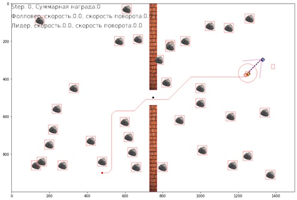
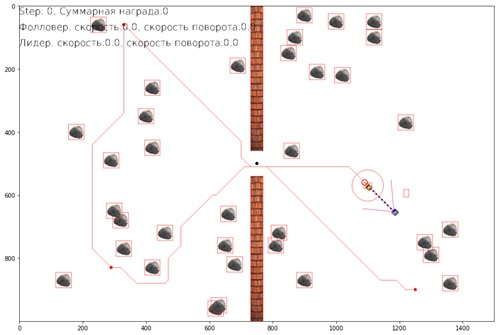
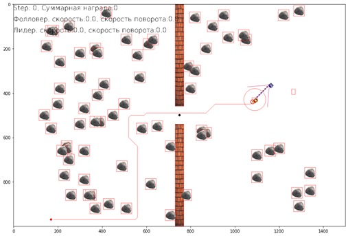
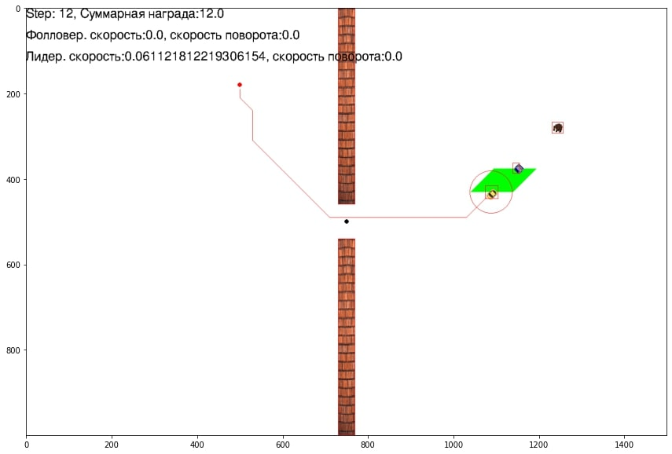
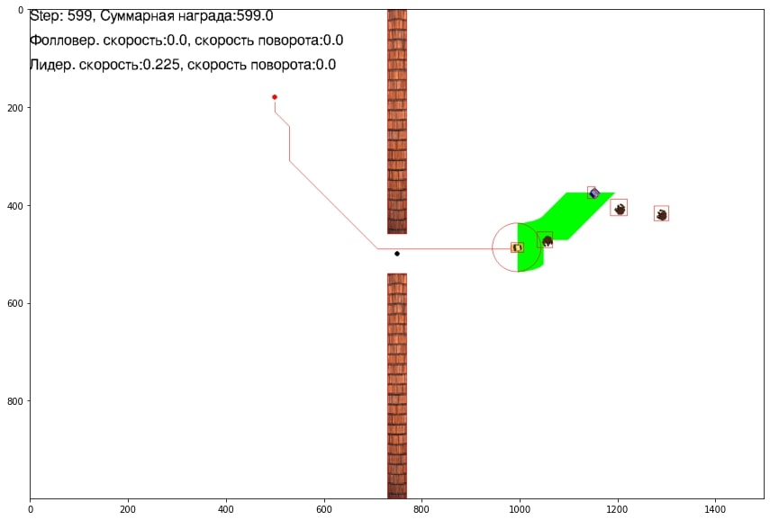
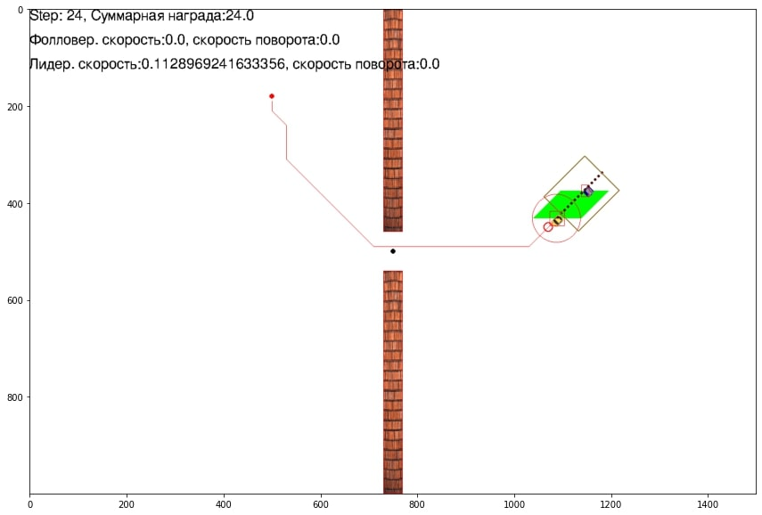
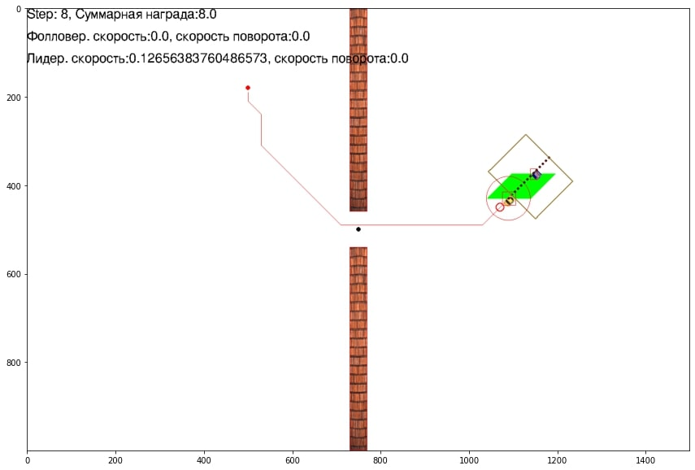
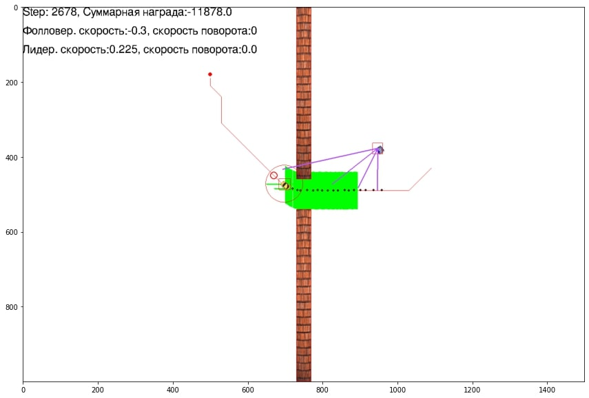
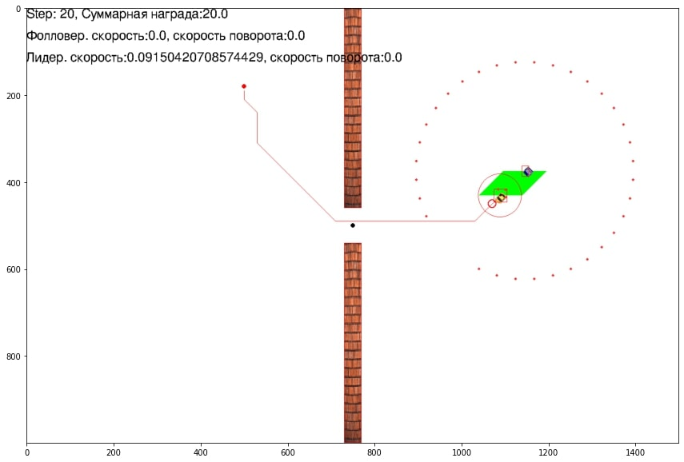
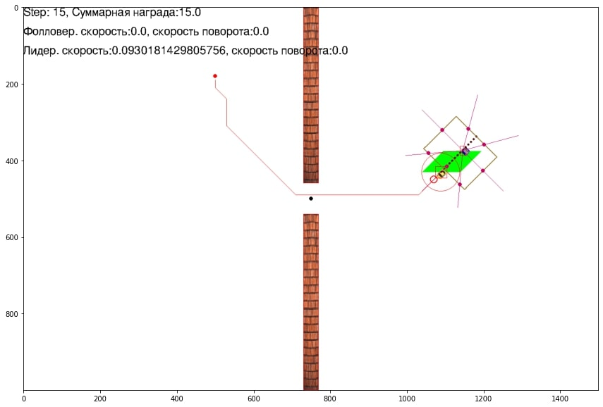

# continuous-grid-arctic
A continuous environment for reinforcement learning of the task of the following the leader

## Репозиторий для решения задачи следования в данной среде методами обучения с подкреплением
Ссылка на репозиторий: https://github.com/gilmoright/RL_robotSim.

В репозитории представлена подробная инструкция по использованию и настройки данной среды для обучения агента для 
задачи следования методами обучения с подкреплением

### Требования:
- Python 3.6+
- gym~=0.21.0
- numpy~=1.19.5
- scipy~=1.7.3
- setuptools~=58.0.4
- matplotlib~=3.5.1
- pygame~=2.1.2
- pandas~=1.3.5


Пожалуйста, используйте этот bibtex, если вы хотите цитировать этот репозиторий в своих публикациях:
```
@article{selivanov2022environment,
  title={An environment emulator for training a neural network model to solve the “Following the leader” task},
  author={Selivanov, Anton and Rybka, Roman and Gryaznov, Artem and Shein, Vyacheslav and Sboev, Alexander},
  journal={Procedia Computer Science},
  volume={213},
  pages={209--216},
  year={2022},
  publisher={Elsevier}
}
```

### Установка
```
git clone https://github.com/sag111/continuous-grid-arctic
cd continuous-grid-arctic
```

### Пример запуска срады:
Для демонстрации работы среды необходимо запускать файл main.py:
>> python main.py

Данный файл имеет следующие аргументы командной строки:
* флаг manual -- если указан, управление агентом проводится вручную, с помощью стрелок;
* n_steps -- определяет число шагов среды, в течение которых проводится проверочная симуляция (по умолчанию: 5000);

По умолчанию одна симуляция длится не более 5000 шагов (задаётся при создании конкретной среды параметром max_steps) 
или до тех пор, пока агент не попадёт в аварию.

Для демонстрации используется пример запуска среды в ручном режиме работы:
```
python main.py --manual
```
В данном режиме управления агентом осуществляется с помощью стрелок на клавиатуре.

## Описание возможностей конфигурации среды. 
В данной среде представлена среда для решения задачи следования. В среде реализованы два агента: ведущий и ведомы.
В среде реализованы статические и динамические препятствия. Статические препятствия представлены двух типов. 
Фиксированные препятствия имитируют узкие места. Конфигурация среды создается/настраивается в 
файле follow_the_leader_continuous_env.py

### Построение маршрутов
В среде реализованы несколько вариантов построения маршрута движения для ведущего агента. 
- флаг path_finding_algorythm для выбора алгоритма построения маршрута. В среде предусмотрено выбор наиболее двух 
быстрых алгоритмов: "astar" и "dstar".
Алгоритм "dstar" имеет возможность построения сложного маршрута с двумя дополнительными точками. 
- флаг multiple_end_points булевая переменная, принимает значения True или False. При установке True работает режим 
построения сложного маршрута через все поле среды.

Пример построения простого маршрута:
<p align="center">

</p>

Пример построения сложного маршрута:
<p align="center">

</p>

### Добавление препятствий
#### Статические препятствия:
- флага obstacle_number - задается количество добавляемых препятствий в среду. Прептятсвия добавляются произвольно по всему полю.
По умолчанию установлено значение 35.

Пример добавления 35 препятствий:
<p align="center">

</p>
Пример добавления 70 препятствий:
<p align="center">

</p>

#### Динамические препятствия:
В среде в качестве динамических препятствий реализованы медведи. Они имеют два режима работы: базовый вариант по 
траектории "змейка" и движение по 4 точкам образуемые за ведущим агентом (move_bear_v4). По умолчанию работает режим движения
по траектори "змейка"
- флаг add_bear - принимает True или False. Когда установлено True происходит добавление динамического препрятствия
- флаг bear_number - задается значение количества добавляемых динамических препятствий. По умолчанию значение 2.
- флаг move_bear_v4 - принимает значение True или False. Если установлено True работает режим движения динамических препятствий 
по 4 точкам за ведущим.

Пример добавления 1 динамического препятствия:
<p align="center">

</p>

Пример добавления 3 динамических препятствий:
<p align="center">

</p>


Также, в среде реализованы различные функции для выбора путевых точек движения динамически препятствий. 
Функции: 
1. _reset_pose_bear - функция, которая перемещает динамических препятствий в корректное положение при перезапуске среды
2. _pos_bears_nearest_leader - функция, которая перемещает динамические препятствия рядом с лидером при перезапуске среды
3. _choose_point_around_lid - функция, которая выбирает путевые точки для движения динамических препятствий по ним вокруг ведущего
4. _choose_points_for_bear_stat - функция, которая формирует путевые точки для динамических препятствий по траектории "змейка"
5. _choose_move_bears_points - функция, которая выбирает точки для движения нескольких динамических препятствий 
вокруг ведущего на разном удалении от ведомого.
6. _chose_cur_point_for_leader - функция, которая выбирает точки для движения динамических препятствий вокруг ведущего
7. _move_bear_v4 - функция, которая формирует путевые точки для движения динамических препятствий по 4 точкам позади ведущего
с перемещением между ними по диагоналям.

Для использования альтернативных функций движений необходимо заменить логику программы в методе frame_step представленном ниже:
```
if self.add_bear:
   for cur_dyn_obj_index in range(0, len(self.game_dynamic_list)):
       if self.move_bear_v4 and cur_dyn_obj_index % 2:
           self.cur_points_for_bear[cur_dyn_obj_index] = self._move_bear_v4(cur_dyn_obj_index)
       else:
           self.cur_points_for_bear[cur_dyn_obj_index] = self._choose_points_for_bear_stat(cur_dyn_obj_index)
       self.game_dynamic_list[cur_dyn_obj_index].move_to_the_point(self.cur_points_for_bear[cur_dyn_obj_index])
   
```
По умолчанию доступна два варианат движения, которые можно изменить в конфигурации среды используя различные флаги,
описанные выше.

### Регулировку максимальных значений скоростей
Настройка максимального значения скоростей объектов
- флаг follower_speed_koeff - принимает значение коэффициента для регулировки максимальной скорости ведомого. По умолчанию 0.5
- флаг leader_speed_coeff - принимает значение коэффициента для регулировки максимальной скорости ведущего. По умолчанию 0.5
- флаг bear_speed_coeff - принимает значение коэффициента для регулировки максимальной скорости динамических объектов.
По умолчанию 1.1
- флаг negative_speed - принимает значение True или False. Устанавливая значение True позволяет ведомому агенту 
двигаться в направлении назад.

### Настройка коридора следования
- флаг corridor_length - принимает численное значение длинны коридора. По умолчанию установлено 4 метра. 
- флаг corridor_width - принимает численное значение ширины коридора (значение расстояния от агента до формирования 
границы коридора/половина ширины коридора) 

Пример коридора с шириной 2 метра (corridor_width=1):
<p align="center">

</p>

Пример коридора с шириной 3 метра (corridor_width=1.5):
<p align="center">

</p>

Добавление коридора происходит с помощью добавления сенсоров LeaderPositionsTracker или LeaderPositionsTracker_v2. 
Краткое описание представлено ниже. (Для основных сенсоров актуально использовать LeaderPositionsTracker_v2)

### Описание сенсоров
В среде реализовано некоторое количество сенсоров для взаимодействия робота с миром. 
Сенсоры реализованы в файле
```
~/utils/sensors.py
```

#### Основные:
   - **LeaderPositionsTracker_v2** - (основной) сенсор позволяющий считывать положения ведущего и на основе этой информации хранит
историю точек маршрута ведущего определенный длинны и настраиваемый коридор следования
   - LeaderCorridor_lasers - "лучевой сенсор" с 7 лучами (baseline), входные признаки для нейросетевой модели на основе измерения информации о
расстояние до препятствий и коридора
   - LeaderCorridor_lasers_v2 - "лучевой сенсор" с настраиваемым количеством лучей (12 в базовой конфигурации) реагирующий
на коридор и препятствия
   - LeaderObstacles_lasers - "лучевой сенсор" с настраиваемым количеством лучей, реагирующий только на препятствия 
(двух типов: статических и динамических)
   - **LeaderCorridor_Prev_lasers_v2** - (основной) "лучевой сенсор" с возможностью сохранять информацию о препятствиях на предыдущих 
шагах. Данная информация позволяет хранить информацию о значениях лучей на предыдущих шагах с учетом пересчета этих значений 
относительно текущего положения робота на каждом новом шаге. Имеет настраиваемые значения лучей и длинны истории. Определяет
ближайшее расстояние до препятствия или коридора следования. 
   - **LaserPrevSensor** - (основной) "лучевой сенсор", аналогичен LeaderCorridor_Prev_lasers_v2. Однако, определяет ближайшее расстояние 
только до препятствий.

#### Устаревшие:
   - LaserSensor - "признаки лидара"
   - LeaderPositionsTracker - сенсор для формирования истории точек маршрута лидера (устаревший вариант)
   - LeaderTrackDetector_vector - сенсор для определения истории точек маршрута лидера (не используется)
   - LeaderTrackDetector_radar - сенсор для определения сектора, в котором находится история маршрута ведущего (первый 
baseline)
   - GreenBoxBorderSensor - сенсор определения зоны безопасности...?
   - Leader_Dyn_Obstacles_lasers - "лучевой сенсор" по определению расстояния только до динамических препятствий
   - FollowerInfo - сенсор для формирования входных признаков с информаций о линейной и угловой скорости робота

#### Использование сенсоров LeaderCorridor_Prev_lasers_v2 и LaserPrevSensor:
Данные сенсоры осуществляют накопление истории координат препятствий и их нормирование 
относительно текущего положения ведомого. При использовании данных сенсоров необходимо задать 
в конфигурации два флага:
- флаг use_prev_obs - принимает значения True или False. При использовании сенсоров необходимо задать True.
- флаг max_prev_obs - принимает значения количества накапливаемых шагов в историю. По умолчанию установлено 5 
(что означает хранение информации об объектах за последние 5 step).

#### Добавление и использование сенсора
Для добавления собственного сенсора необходимо написать класс в файле sensors.py и добавить в конце файла
в переменную SENSOR_NAME_TO_CLASS название данного сенсора. 
Также, необходимо зарегистрировать новый сенсор в файле 

```
~/utils/wrappers.py
```
Существует два варианта:
1. Добавить по аналогии полученный сенсор в класс ContinuousObserveModifier_v0.
2. Написать собственный класс по аналогии с ContinuousObserveModifier_v0.

Чтобы использовать сенсор, необходимо в конфигурации в переменной follower_sensors прописать название и параметры сенсора.

Ниже представлен пример использования сенсора:

```
 follower_sensors={
     'LeaderPositionsTracker_v2': {
         'sensor_name': 'LeaderPositionsTracker_v2',
         'eat_close_points': True,
         'saving_period': 8,
         'start_corridor_behind_follower':True
     },
     "LeaderCorridor_Prev_lasers_v2": {
            'sensor_name': 'LeaderCorridor_Prev_lasers_v2',
            "react_to_obstacles": True,
            "front_lasers_count": 2,
            "back_lasers_count": 2,
            "react_to_safe_corridor": True,
            "react_to_green_zone": True,
            "laser_length": 150
     }
 }
```

### Примеры добавления основных сенсоров:
#### LeaderTrackDetector_vector
Пример использования признаков радара:
<p align="center">

</p>

#### LaserSensor
Пример использования признаков лидара:
<p align="center">

</p>

#### LeaderCorridor_lasers
Пример использования признаков "лучевого сенсора" в базовой конфигурации с 7 лучами. Реагирует 
на коридор и препятствия:
<p align="center">

</p>

#### LeaderCorridor_lasers_v2
Пример использования признаков "лучевого сенсора" с настраиваемым количеством лучей (по умолчанию 12) с реагированием 
на коридор и препятствия:
<p align="center">

</p>

#### LeaderObstacles_lasers
Пример использования признаков "лучевого сенсора", который реагирует только на препятствия (по умолчанию 30 лучей):
<p align="center">

</p>

Сенсоры **LeaderCorridor_Prev_lasers_v2** и **LaserPrevSensor** аналогичны **LeaderCorridor_lasers_v2** 
и **LeaderObstacles_lasers** соответсвенно. Их отличия состоят в том, что они сохраняют историю точек препятствий и
нормируют значения на каждом шаге относительно текущей позиции агента.

### Конструкция награды
Правила награды реализованы в файле:
```
utils/reward_constructor.py
```
Ниже представлена конструкция награды:
```
 rewar+= 1, если агент находится на маршруте и на нужной дистанции от ведущего
 rewar+= 0,1, если агент находится на маршруте, но не на нужной дистанции от ведущего
 rewar+= 0,5, если агент находится отклонился от маршрута в пределах допустимого
 rewar+= 1, если ведущий осуществеляет движение
 
 rewar+= -10, если агент столкнулся с прептятствием или ведущим
 rewar+= -1, если агент находится не на маршруте и вне допустимой зоны от ведущего
 rewar+= -5, если агент находится близко к ведущему
 rewar+= -1, если если ведущий остановил свое движение в результате команды ведомого "остановись"
```

## Конфигурация собственной среды
Чтобы создать собственную конфигурацию среды, необходимо выполнить следующие шаги: 
1. В файле follow_the_leader_continuous_env.py создать наследующий основную среду класс (как, например, Test-Cont-Env-Auto-v0);
2. В методе init созданного класса задать нужные параметры при инициализации родительского класса 
(полный список параметров смотреть в методе init класса Game);
3. Далее, "зарегистрировать" среду как среду gym с помощью gym_register, по следующему шаблону:

    3.1. id=Test-Cont-Env-<собственное_название>-v0;
    
    3.2. follow_the_leader_continuous_env:<название класса среды, который создан в п.1>;
    
    3.3. reward_threshold по своему желанию.


## Демонстрационные материалы

В папке notebooks располагается два демонстрационных Jupyter блокнота. 
1. Env_demo.ipynb содержит демонстрационную программу для взаимодействия со средой
2. Ray_train_demo.ipynb содержит демонстрационную программу для обучения агента и тестирования полученной модели 
с использованием библиотеки ray[rllib]

Ниже представлено тестовое прохождение одного маршрута с использованием **LeaderPositionsTracker_v2**, 
**LeaderCorridor_Prev_lasers_v2**, **LaserPrevSensor**. Модель обучена в конфигурации среды с 35 статическими 
препятствиями и 1 динамическим. 

<p align="center">

</p>
