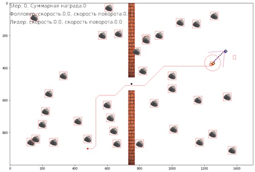
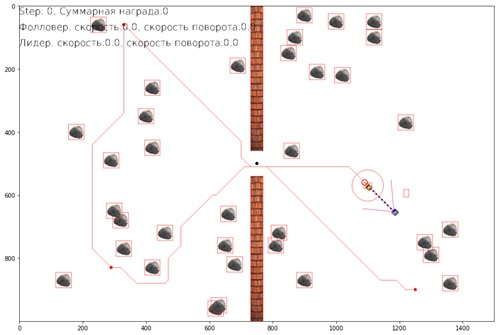
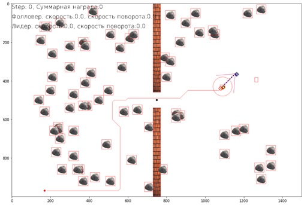
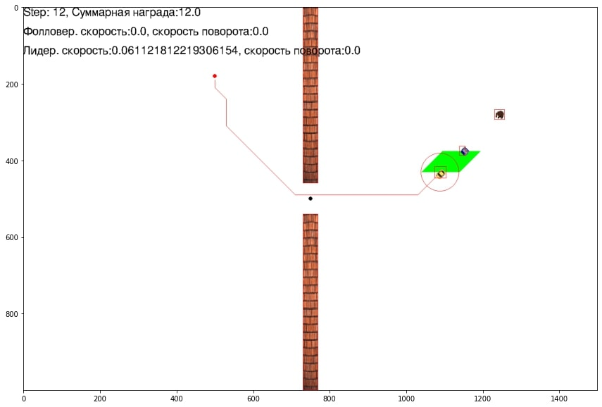
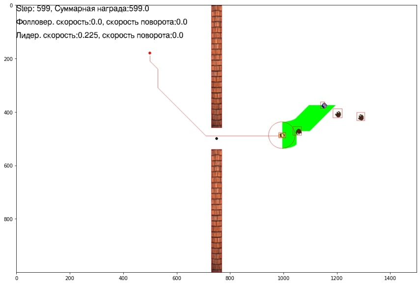
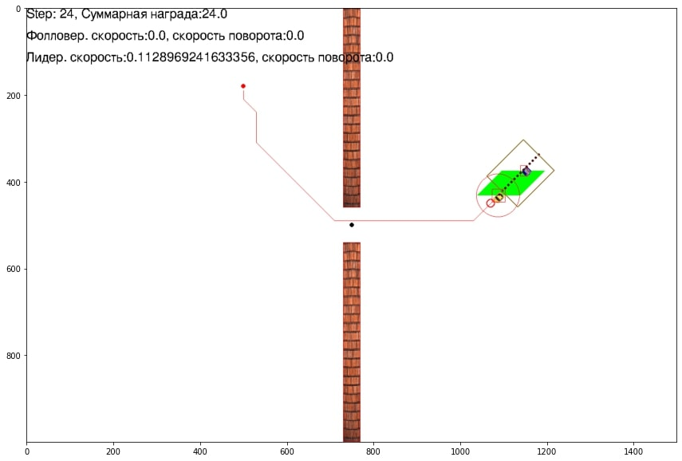
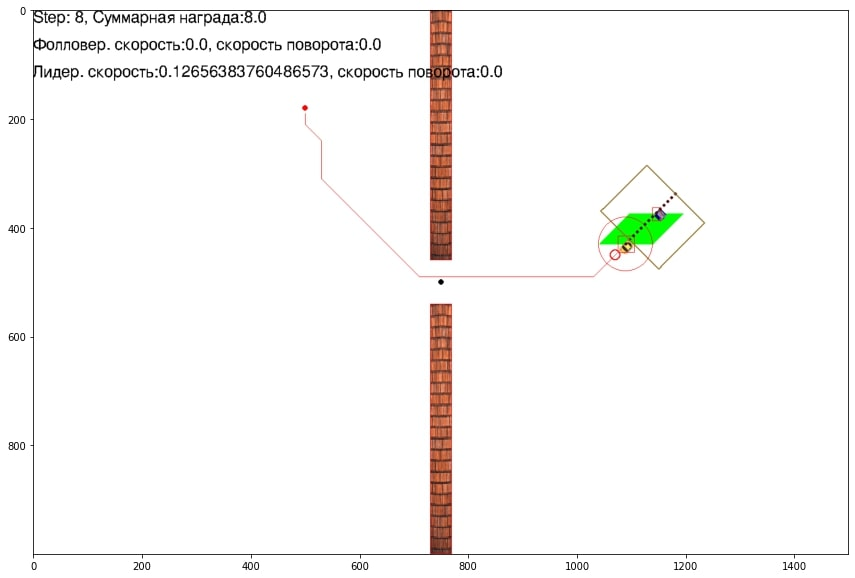

## Основные модули
- [src/arctic_gym/run.py](../src/arctic_gym/run.py) - основной файл при запуске решения задачи следования. 
Запуская данный файл происходит запуск модели и получение основной информации из среды. Также, присутствует вспомогательный 
функционал в виде системы безопасности робота.
- [src/arctic_gym/arctic_env/arctic_env.py](../src/arctic_gym/arctic_env/arctic_env.py) - файл содержащий все скрипты для 
осуществления рещения задачи следования. Получение данных лидара, камеры, распознавание объектов на изображении и т.д.
- [src/arctic_gym/gazebo_utils/gazebo_tracker.py](../src/arctic_gym/gazebo_utils/gazebo_tracker.py) - файл содержащий классы,
реализующие сенсоры, адаптированные под 3D среду.
- 


## Краткое описание возможностей интеграции нейросетевой модели для задачи следования
Здесь представлено описание интеграции системы управления движением робота для задачи следования в 3D среду. 
Программная интеграция находится в [папке](../src/arctic_gym)
В папке представлен основной функционал по интеграции данной модели в среду Gazebo с мобильным роботом, который 
вы можете использовать в собственном проекте. 

### Наличие вращающейся камеры

Блок системы безопасности (режим поиска ведущего). Файл run.py, функция _rotate_the_camera 

## Основные модули
- [follow_the_leader_continuous_env](../src/continuous_grid_arctic/follow_the_leader_continuous_env.py) - содержит класс среды, и процедуры регистрации среды. При импорте этого модуля происходит регистрация сред;
- [utils/classes](../src/continuous_grid_arctic/utils/classes.py) - классы роботов ведущего и ведомого.
- [utils/sensors](../src/continuous_grid_arctic/utils/sensors.py) - классы сенсоров, реализующие процедуры рассчёта наблюдаемых показателей.
- [utils/wrappers](../src/continuous_grid_arctic/utils/wrappers.py) - классы обёртки, для пред/постобработки наблюдений и действий для взаимодействия среды и алгоритма управления
- utils/astar, utils/dstar, utils/lqr_rrt_star, utils/rrt, utils/rrt_star - алгоритмы расчёта маршрута ведущего
- [utils/reward_constructor](../src/continuous_grid_arctic/utils/reward_constructor.py) - класс для хранения значений используемых в качестве награды
- [utils/misc](../src/continuous_grid_arctic/utils/misc.py) - прочие полезные функции, например для расчёта геометрии
- [utils/imgs](../src/continuous_grid_arctic/utils/imgs) - спрайты для визуализации среды;

## Класс среды
[Класс среды](https://github.com/sag111/continuous-grid-arctic/blob/slava_3/continuous_grid_arctic/follow_the_leader_continuous_env.py#L33) содержит следующие параметры:
- Настройки визуализации: game_width, game_height, framerate, show_leader_path, show_leader_trajectory, show_rectangles, show_box, show_sensors, pixels_to_meter
- Настройки окружения: 
  - глобальные: frames_per_step, random_frames_per_step, simulation_time_limit, max_steps, manual_control, early_stopping
  - настройки препятствий: add_obstacles, obstacle_number, add_bear, bear_number, multi_random_bears, move_bear_v4, bear_behind, bear_speed_coeff
  - настройки поведения роботов: leader_pos_epsilon, trajectory, step_grid, follower_sensors, leader_speed_regime, leader_acceleration_regime, discrete_action_space, constant_follower_speed, path_finding_algorythm, multiple_end_points, corridor_length, corridor_width, negative_speed, follower_speed_koeff, leader_speed_coeff, use_prev_obs, max_prev_obs
- Настройки задачи: reward_config, min_distance, max_distance, max_dev, warm_start, aggregate_reward.

Отдельное описание каждого параметра в [классе среды](https://github.com/sag111/continuous-grid-arctic/blob/slava_3/continuous_grid_arctic/follow_the_leader_continuous_env.py#L33)

## Построение маршрутов
В среде реализованы несколько вариантов построения маршрута движения для ведущего агента. 
- флаг path_finding_algorythm для выбора алгоритма построения маршрута. В среде предусмотрено выбор наиболее двух 
быстрых алгоритмов: "astar" и "dstar".
Алгоритм "dstar" имеет возможность построения сложного маршрута с двумя дополнительными точками. 
- флаг multiple_end_points булевая переменная, принимает значения True или False. При установке True работает режим 
построения сложного маршрута через все поле среды.

Пример построения простого маршрута:
<p align="center">

</p>

Пример построения сложного маршрута:
<p align="center">

</p>

## Добавление препятствий
#### Статические препятствия:
- флага obstacle_number - задается количество добавляемых препятствий в среду. Прептятсвия добавляются произвольно по всему полю.
По умолчанию установлено значение 35.

Пример добавления 35 препятствий:
<p align="center">

</p>
Пример добавления 70 препятствий:
<p align="center">

</p>

### Динамические препятствия:
В среде в качестве динамических препятствий реализованы медведи. Они имеют два режима работы: базовый вариант по 
траектории "змейка" и движение по 4 точкам образуемые за ведущим агентом (move_bear_v4). По умолчанию работает режим движения
по траектори "змейка"
- флаг add_bear - принимает True или False. Когда установлено True происходит добавление динамического препрятствия
- флаг bear_number - задается значение количества добавляемых динамических препятствий. По умолчанию значение 2.
- флаг move_bear_v4 - принимает значение True или False. Если установлено True работает режим движения динамических препятствий 
по 4 точкам за ведущим.

Пример добавления 1 динамического препятствия:
<p align="center">

</p>

Пример добавления 3 динамических препятствий:
<p align="center">

</p>


Также, в среде реализованы различные функции для выбора путевых точек движения динамически препятствий. 
Функции: 
1. _reset_pose_bear - функция, которая перемещает динамических препятствий в корректное положение при перезапуске среды
2. _pos_bears_nearest_leader - функция, которая перемещает динамические препятствия рядом с лидером при перезапуске среды
3. _choose_point_around_lid - функция, которая выбирает путевые точки для движения динамических препятствий по ним вокруг ведущего
4. _choose_points_for_bear_stat - функция, которая формирует путевые точки для динамических препятствий по траектории "змейка"
5. _choose_move_bears_points - функция, которая выбирает точки для движения нескольких динамических препятствий 
вокруг ведущего на разном удалении от ведомого.
6. _chose_cur_point_for_leader - функция, которая выбирает точки для движения динамических препятствий вокруг ведущего
7. _move_bear_v4 - функция, которая формирует путевые точки для движения динамических препятствий по 4 точкам позади ведущего
с перемещением между ними по диагоналям.

Для использования альтернативных функций движений необходимо заменить логику программы в методе frame_step представленном ниже:
```
if self.add_bear:
   for cur_dyn_obj_index in range(0, len(self.game_dynamic_list)):
       if self.move_bear_v4 and cur_dyn_obj_index % 2:
           self.cur_points_for_bear[cur_dyn_obj_index] = self._move_bear_v4(cur_dyn_obj_index)
       else:
           self.cur_points_for_bear[cur_dyn_obj_index] = self._choose_points_for_bear_stat(cur_dyn_obj_index)
       self.game_dynamic_list[cur_dyn_obj_index].move_to_the_point(self.cur_points_for_bear[cur_dyn_obj_index])
   
```
По умолчанию доступна два варианат движения, которые можно изменить в конфигурации среды используя различные флаги,
описанные выше.

## Регулировку максимальных значений скоростей
Настройка максимального значения скоростей объектов
- флаг follower_speed_koeff - принимает значение коэффициента для регулировки максимальной скорости ведомого. По умолчанию 0.5
- флаг leader_speed_coeff - принимает значение коэффициента для регулировки максимальной скорости ведущего. По умолчанию 0.5
- флаг bear_speed_coeff - принимает значение коэффициента для регулировки максимальной скорости динамических объектов.
По умолчанию 1.1
- флаг negative_speed - принимает значение True или False. Устанавливая значение True позволяет ведомому агенту 
двигаться в направлении назад.

## Настройка коридора следования
- флаг corridor_length - принимает численное значение длинны коридора. По умолчанию установлено 4 метра. 
- флаг corridor_width - принимает численное значение ширины коридора (значение расстояния от агента до формирования 
границы коридора/половина ширины коридора) 

Пример коридора с шириной 2 метра (corridor_width=1):
<p align="center">

</p>

Пример коридора с шириной 3 метра (corridor_width=1.5):
<p align="center">

</p>

Добавление коридора происходит с помощью добавления сенсоров LeaderPositionsTracker или LeaderPositionsTracker_v2. 
Краткое описание представлено ниже. (Для основных сенсоров актуально использовать LeaderPositionsTracker_v2)


## Расчёт награды
Правила награды реализованы в файле:
```
utils/reward_constructor.py
```
Ниже представлены правила расчёта награды:
```
 rewar+= 1, если агент находится на маршруте и на нужной дистанции от ведущего
 rewar+= 0,1, если агент находится на маршруте, но не на нужной дистанции от ведущего
 rewar+= 0,5, если агент находится отклонился от маршрута в пределах допустимого
 rewar+= 1, если ведущий осуществеляет движение
 
 rewar+= -10, если агент столкнулся с прептятствием или ведущим
 rewar+= -1, если агент находится не на маршруте и вне допустимой зоны от ведущего
 rewar+= -5, если агент находится близко к ведущему
 rewar+= -1, если если ведущий остановил свое движение в результате команды ведомого "остановись"
```