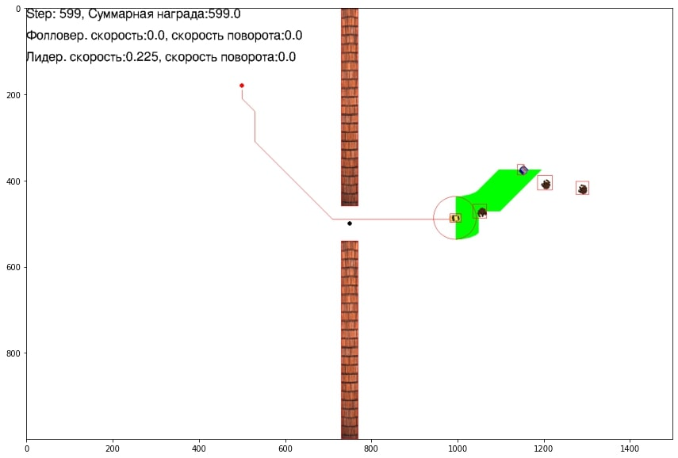
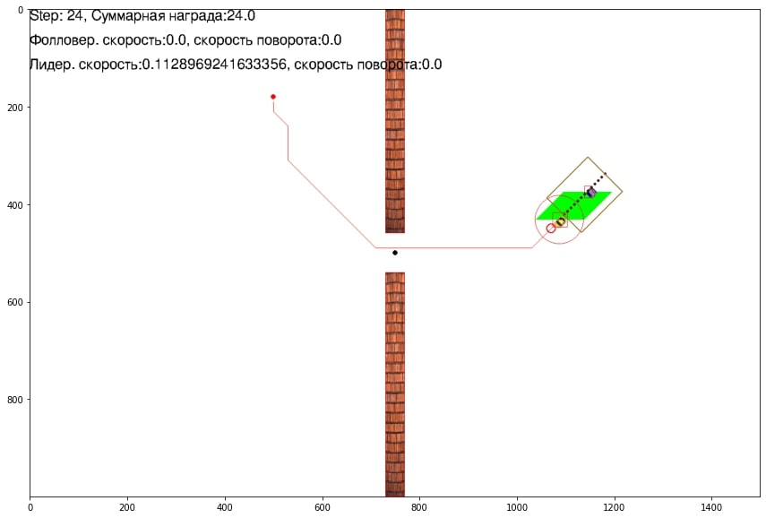
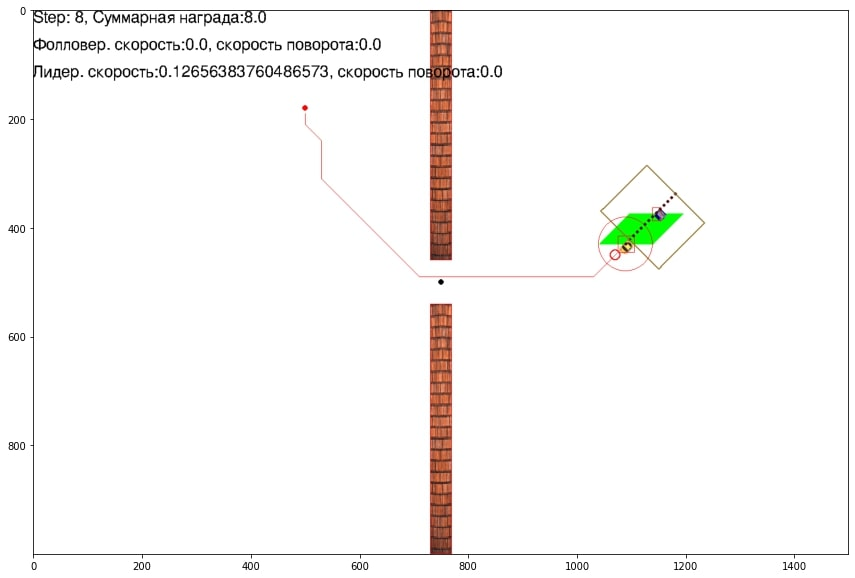

## Main modules
- [follow_the_leader_continuous_env](../src/continuous_grid_arctic/follow_the_leader_continuous_env.py) environment 
class, when importing this module, environments are registered

- [utils/classes](../src/continuous_grid_arctic/utils/classes.py) - the leader and the agent classes.

- [utils/sensors](../src/continuous_grid_arctic/utils/sensors.py) - classes of sensors that implement procedures 
for calculating observed indicators

- [utils/wrappers](../src/continuous_grid_arctic/utils/wrappers.py) - wrapper classes for pre/post-processing of 
observations and actions for interaction between the environment and the control algorithm

- [utils/astar](../src/continuous_grid_arctic/utils/astar.py), 
[utils/dstar](../src/continuous_grid_arctic/utils/dstar.py), 
[utils/lqr_rrt_star](../src/continuous_grid_arctic/utils/lqr_rrt_star.py), 
[utils/rrt](../src/continuous_grid_arctic/utils/rrt.py), 
[utils/rrt_star](../src/continuous_grid_arctic/utils/rrt_star.py) - algorithms for calculating the route of the leader

- [utils/reward_constructor](../src/continuous_grid_arctic/utils/reward_constructor.py) - class for storing values used 
as rewards

- [utils/misc](../src/continuous_grid_arctic/utils/misc.py) - other useful functions, for example for calculating 
geometry

- [utils/imgs](../src/continuous_grid_arctic/imgs) - sprites for visualizing the environment

## Environment class
[follow_the_leader_continuous_env](../src/continuous_grid_arctic/follow_the_leader_continuous_env.py) creates a 
continuous environment for "following the leader" task. It contains the following parameters:
- Visualization settings: 
  ```
  game_width                game screen width, pixels
  game_height               game screen height, pixels
  framerate                 framerate for pygame simulation
  pixels_to_meter           number of pixels per 1 meter
  show_leader_path          flag, displaying the entire the leader's route
  show_leader_trajectory    flag, displaying the route taken by the leader
  show_rectangles           flag, displaying interaction rectangles
  show_box                  flag, displaying the boundaries within which the agent needs to be
  show_sensors              flag, drawing sensors
  ```
- Environment settings: 
  - global: 
    ```
    frames_per_step           number of frames per 1 step
    random_frames_per_step    range from which frames_per_step will be sampled
    simulation_time_limit     time limit for simulation, sec, if None - not limited
    max_steps                 the maximum number of steps for one simulation
    manual_control            use manual control of the agent;
    ```
  - obstacles: 
    ```
    add_obstacles         flag, adding static obstacles
    obstacle_number       number of randomly generated static obstacles
    add_bear              flag, adding dynamic obstacles
    bear_number           number of dynamic obstacles
    move_bear_v4          flag, behavior of dynamic object
    ```
  - the leader and the agent: 
    ```
    leader_pos_epsilon          the distance in pixels from the trajectory point within which the leader passed through the point
    trajectory                  the list of the leader's route. If None, the list is generated randomly
    step_grid                   step grid for planning trajectory
    follower_sensors            dictionary of the agent sensors configuration
    leader_speed_regime         dictionary - key - number of steps, value - leader speed (fraction of maximum?)
    constant_follower_speed     flag, the agent's speed will always be maximum, and only one action will be used - rotation
    path_finding_algorythm      pathfinding algorithm to use for the leader, "astar" or "dstar"
    multiple_end_points         False - only one endpoint is used, True - several points and a more complex route are generated
    ```
- Task settings: 
  ```
  reward_config       path to the reward json created using the reward_constructor class. If None, creates by default (Ivan v.1)
  min_distance        the minimum distance, m, that the agent must maintain from the leader
  max_distance        the maximum distance, m, beyond which the agent must not lag behind the leader (along the route)
  max_dev             the maximum distance, m, within which the agent can deviate from the route
  warm_start          the number of steps within which the agent will not receive a penalty (currently not fully implemented)
  aggregate_reward    if True, step will give the aggregated reward
  ```

## Path planning
The environment implements several options for constructing a route for the leader:
- parameter path_finding_algorythm to select a path finding algorithm. Two fast algorithms are implemented "astar" 
and "dstar". Parameter "dstar" has the ability to build a complex route with two additional points.
- parameter multiple_end_points is bool. If True, the mode of constructing a complex route 
through the entire field of the environment works.

Example of planning a simple path:
<p align="center">

</p>

Example of planning a complex path:
<p align="center">

</p>

## Adding obstacles
#### Static obstacles:
parameter obstacle_number specifies the number of obstacles to be added to the environment. Obstacles are added 
randomly throughout the field. The default value is 35.

Example of adding 35 obstacles:
<p align="center">

</p>
Example of adding 70 obstacles:
<p align="center">

</p>

### Dynamic obstacles:
Bears are implemented in the environment as dynamic obstacles. They have two modes of operation: the basic version 
along the “snake” trajectory and movement along 4 points formed behind the leading agent (move_bear_v4). By default, 
the movement mode works along the “snake” trajectory.
- parameter add_bear is bool. If True, a dynamic obstacle is added
- parameter bear_number specifies the number of dynamic obstacles to be added. Default value is 2.
- parameter move_bear_v4 is bool. If True, the mode of movement of dynamic obstacles at 4 points behind the leader.

Example of adding 1 dynamic obstacle:
<p align="center">

</p>

Example of adding 3 dynamic obstacle:
<p align="center">

</p>


Also, the environment implements various functions for selecting waypoints for moving dynamic obstacles:
1. **_reset_pose_bear** moves dynamic obstacles to the correct position when restarting the environment
2. **_pos_bears_nearest_leader** moves dynamic obstacles near the leader when the environment is restarted
3. **_choose_point_around_lid** selects waypoints for dynamic obstacles to move around them around the leader
4. **_choose_points_for_bear_stat** generates waypoints for dynamic obstacles along a "snake" trajectory
5. **_choose_move_bears_points** selects points for the movement of several dynamic obstacles around the leader 
at different distances from the follower
6. **_chose_cur_point_for_leader** selects points for the movement of dynamic obstacles around the leader
7. **_move_bear_v4** forms waypoints for the movement of dynamic obstacles along 4 points behind the leader, moving 
between them diagonally

To use alternative motion functions, it is necessary to replace the program logic in the frame_step method presented 
below:
```
if self.add_bear:
   for cur_dyn_obj_index in range(0, len(self.game_dynamic_list)):
       if self.move_bear_v4 and cur_dyn_obj_index % 2:
           self.cur_points_for_bear[cur_dyn_obj_index] = self._move_bear_v4(cur_dyn_obj_index)
       else:
           self.cur_points_for_bear[cur_dyn_obj_index] = self._choose_points_for_bear_stat(cur_dyn_obj_index)
       self.game_dynamic_list[cur_dyn_obj_index].move_to_the_point(self.cur_points_for_bear[cur_dyn_obj_index])
   
```
By default, two movement options are available, which can be changed in the environment configuration using the various 
parameters described above.


## Safe zone
These parameters select inside Sensors:
- parameter corridor_length takes a numerical value for the length of the corridor. The default is 4 meters. 
- parameter corridor_width takes a numerical value of the corridor width (the distance from the agent to the formation 
of the corridor border/half the corridor width)

Example of a corridor with a width of 2 meters (corridor_width=1):
<p align="center">

</p>

Example of a corridor with a width of 3 meters (corridor_width=1.5):
<p align="center">

</p>

Adding a corridor occurs by adding LeaderPositionsTracker or LeaderPositionsTracker_v2 sensors.


## Reward

```
rewar+= 1, if the agent is on the route and at the required distance from the leader
rewar+= 0.1, if the agent is on the route, but not at the required distance from the leader
rewar+= 0.5, if the agent deviates from the route within the acceptable range
rewar+= 1 if the leader is moving
 
rewar+= -10 if the agent collided with an obstacle or leader
rewar+= -1, if the agent is not on the route and outside the acceptable range from the leader
rewar+= -5 if the agent is close to the leader
rewar+= -1, if the leader stopped his movement as a result of the agent's command "stop"
```