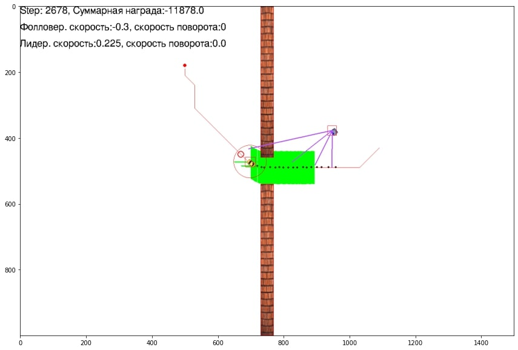
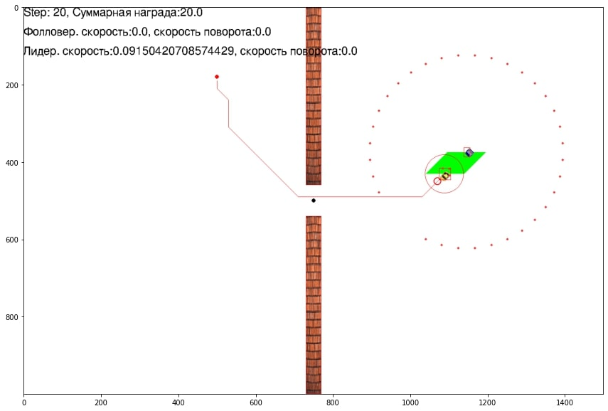
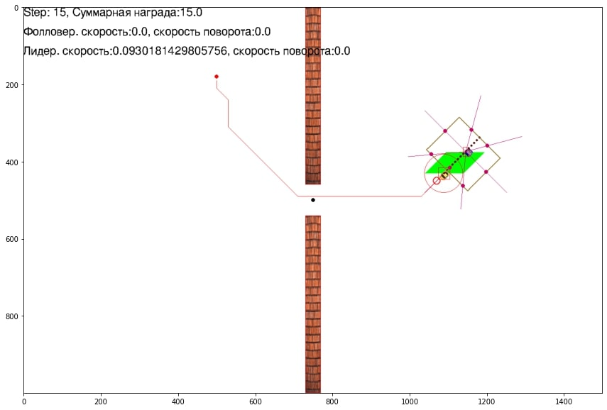

### Описание сенсоров
В среде реализовано некоторое количество сенсоров для взаимодействия робота с миром. 
Сенсоры реализованы в файле
```
~/utils/sensors.py
```

#### Основные:
   - **LeaderPositionsTracker_v2** - (основной) сенсор позволяющий считывать положения ведущего и на основе этой информации хранит
историю точек маршрута ведущего определенный длинны и настраиваемый коридор следования
   - LeaderCorridor_lasers - "лучевой сенсор" с 7 лучами (baseline), входные признаки для нейросетевой модели на основе измерения информации о
расстояние до препятствий и коридора
   - LeaderCorridor_lasers_v2 - "лучевой сенсор" с настраиваемым количеством лучей (12 в базовой конфигурации) реагирующий
на коридор и препятствия
   - LeaderObstacles_lasers - "лучевой сенсор" с настраиваемым количеством лучей, реагирующий только на препятствия 
(двух типов: статических и динамических)
   - **LeaderCorridor_Prev_lasers_v2** - (основной) "лучевой сенсор" с возможностью сохранять информацию о препятствиях на предыдущих 
шагах. Данная информация позволяет хранить информацию о значениях лучей на предыдущих шагах с учетом пересчета этих значений 
относительно текущего положения робота на каждом новом шаге. Имеет настраиваемые значения лучей и длинны истории. Определяет
ближайшее расстояние до препятствия или коридора следования. 
   - **LaserPrevSensor** - (основной) "лучевой сенсор", аналогичен LeaderCorridor_Prev_lasers_v2. Однако, определяет ближайшее расстояние 
только до препятствий.

   - **LeaderCorridor_Prev_lasers_v2_compas** - новый "лучевой сенсор", аналогичен LeaderCorridor_Prev_lasers_v2, но с 
возможность определять направления в формируемых признаках, исходный вектор, увеличивается длинной в 4 раза, и разбивается нулями
в незадействованных сторонах. Пример OBSERVATION состоят из конкатенированных векторов признаков, которые формируется 
следующим образом front = [1, 1, 0, 0, 0, 0, 0, 0], right = [0, 0, 1, 1, 0, 0, 0, 0], back = [0, 0, 0, 0, 1, 1, 0, 0], 
left = [0, 0, 0, 0, 1, 1]. RES_OBS = np.concatenate((front, right, behind, left), axis=None)
   - **LaserPrevSensor_compas** - новый "лучевой сенсор", по принципу работы аналогичен LaserPrevSensor, с указанием 
направлением, как LeaderCorridor_Prev_lasers_v2_compas.

**ВАЖНО:**
На сенсоры LeaderCorridor_Prev_lasers_v2_compas и LaserPrevSensor_compas распрастраняются аналогичные правила, как и на 
LeaderCorridor_Prev_lasers_v2 и LaserPrevSensor

#### Устаревшие:
   - LaserSensor - "признаки лидара"
   - LeaderPositionsTracker - сенсор для формирования истории точек маршрута лидера (устаревший вариант)
   - LeaderTrackDetector_vector - сенсор для определения истории точек маршрута лидера (не используется)
   - LeaderTrackDetector_radar - сенсор для определения сектора, в котором находится история маршрута ведущего (первый 
baseline)
   - GreenBoxBorderSensor - сенсор определения зоны безопасности на основе лидара. Очень медленная, не оптимизированная реализация.
   - Leader_Dyn_Obstacles_lasers - "лучевой сенсор" по определению расстояния только до динамических препятствий
   - FollowerInfo - сенсор для формирования входных признаков с информаций о линейной и угловой скорости робота

#### Использование сенсоров LeaderCorridor_Prev_lasers_v2 и LaserPrevSensor:
Данные сенсоры осуществляют накопление истории координат препятствий и их нормирование 
относительно текущего положения ведомого. При использовании данных сенсоров необходимо задать 
в конфигурации два флага:
- флаг use_prev_obs - принимает значения True или False. При использовании сенсоров необходимо задать True.
- флаг max_prev_obs - принимает значения количества накапливаемых шагов в историю. По умолчанию установлено 5 
(что означает хранение информации об объектах за последние 5 step).

#### Добавление и использование сенсора
Для добавления собственного сенсора необходимо написать класс в файле sensors.py и добавить в конце файла
в переменную SENSOR_NAME_TO_CLASS название данного сенсора. 
Также, необходимо зарегистрировать новый сенсор в файле 

```
~/utils/wrappers.py
```
Существует два варианта:
1. Добавить по аналогии полученный сенсор в класс ContinuousObserveModifier_v0.
2. Написать собственный класс по аналогии с ContinuousObserveModifier_v0.

Чтобы использовать сенсор, необходимо в конфигурации в переменной follower_sensors прописать название и параметры сенсора.

Ниже представлен пример использования сенсора:

```
 follower_sensors={
     'LeaderPositionsTracker_v2': {
         'sensor_name': 'LeaderPositionsTracker_v2',
         'eat_close_points': True,
         'saving_period': 8,
         'start_corridor_behind_follower':True
     },
     "LeaderCorridor_Prev_lasers_v2": {
            'sensor_name': 'LeaderCorridor_Prev_lasers_v2',
            "react_to_obstacles": True,
            "front_lasers_count": 2,
            "back_lasers_count": 2,
            "react_to_safe_corridor": True,
            "react_to_green_zone": True,
            "laser_length": 150
     }
 }
```

Также, при необходимости, можно прописать дополнительную логику использования сенсора в [классе ведомого](https://github.com/sag111/continuous-grid-arctic/blob/slava_3/continuous_grid_arctic/utils/classes.py#L245). Например сенсоры LeaderPositionsTracker или LeaderPositionsTracker_v2 должны отрабатывать до сенсоров, использующих их показания. А некоторые сенсоры, могут требовать на вход функции scan() помимо ссылки на среду ещё и показания предыдущих сенсоров.


### Примеры добавления основных сенсоров:
#### LeaderTrackDetector_vector
Пример использования признаков радара:
<p align="center">

</p>

#### LaserSensor
Пример использования признаков лидара:
<p align="center">

</p>

#### LeaderCorridor_lasers
Пример использования признаков "лучевого сенсора" в базовой конфигурации с 7 лучами. Реагирует 
на коридор и препятствия:
<p align="center">

</p>

#### LeaderCorridor_lasers_v2
Пример использования признаков "лучевого сенсора" с настраиваемым количеством лучей (по умолчанию 12) с реагированием 
на коридор и препятствия:
<p align="center">

</p>

#### LeaderObstacles_lasers
Пример использования признаков "лучевого сенсора", который реагирует только на препятствия (по умолчанию 30 лучей):
<p align="center">

</p>

Сенсоры **LeaderCorridor_Prev_lasers_v2** и **LaserPrevSensor** аналогичны **LeaderCorridor_lasers_v2** 
и **LeaderObstacles_lasers** соответсвенно. Их отличия состоят в том, что они сохраняют историю точек препятствий и
нормируют значения на каждом шаге относительно текущей позиции агента.